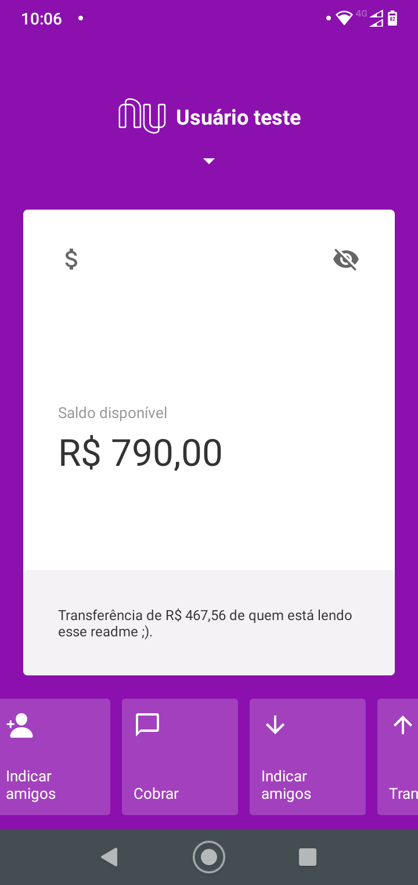

# Clone do App Nubank (Atualizado)

> Projeto Mobile realizado com React Native da interface principal da antiga versão do App Nubank. Fiz pelo conteúdo do video do YouTube da RocketSeat feito em 2019, porém utilizei com as ferramentas mais recentes.  

## 💻 Pré-requisitos

* Versão mais recente de: 
`<React Native, React Navigation v.5, Expo v.41>`.
* Trabalho no sistema operacional:`< Linux Ubuntu 20.04 lts >`
* Documentação do projeto: 
`<https://reactnavigation.org/docs/getting-started>`.
`<https://docs.swmansion.com/react-native-gesture-handler/docs/>`.

## 📫 Contribuindo para <App-Nubank>

1. Bifurque este repositório.
2. Crie um branch: `git checkout -b <App-Nubank>`.
3. Faça suas alterações e confirme-as: `git commit -m '<mensagem_commit>'`
4. Envie para o branch original: `git push origin <App-Nubank> / <local>`
5. Crie a solicitação de pull.

## 😄 Seja um dos contribuidores 

[⬆ Voltar ao topo](#nome-do-projeto) 

